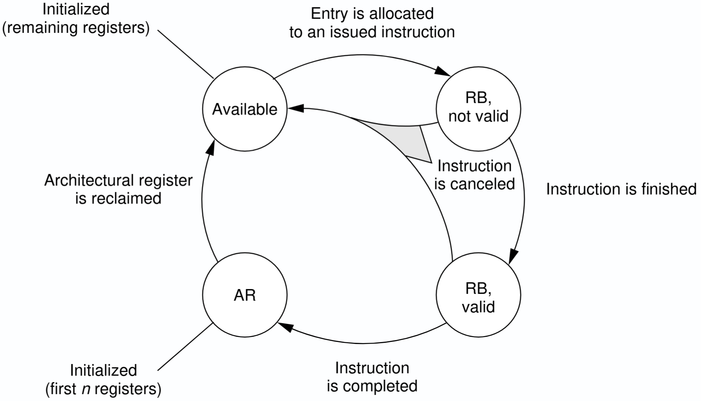

# CS-470 Homework 1

Simple implementation of the [MIPS R10000 implementation](https://www.inf.ufpr.br/hexsel/ci312/mips10k.pdf) in C, providing a cycle accurate simulation of the processor.

# Specification

The implementation supports out-of-order execution, register renaming, and precise exceptions.
4 instructions are fetched per cycle and 32 instructions can be in-flight at any time. The implementation is fully pipelined.

## Register file

The processor uses architectural and physical 64-bit registers:

- 32 logical registers (`x0`-`x31`)
- 64 physical registers (`p0`-`p63`)

At reset, all physical registers are initialized to `0`, and the Register Map Table is initialized with an identity mapping (`xN -> pN` for `N in [0, 31]`).
The Free List initially contains `p32` to `p63`.

The lifecycle of a register is described under the following FSM, from [D. Sima, IEEE 2000](https://www.eecs.umich.edu/courses/eecs470/papers/RegisterRenaming_Sima.pdf)


## Pipeline

The processor is organized as a fully pipelined out-of-order design with a width of 4 instructions per cycle.

Main structures and capacities:

- Decoded Instruction Register (DIR): 4 entries
- Integer Queue (IQ): 32 entries
- Active List (ROB-like): 32 entries
- ALUs: 4 parallel ALUs, each with 2 internal stages

Stages are evaluated every cycle from the end of the pipeline to the front:

1. **Commit**: commits up to 4 oldest completed instructions in order.
2. **Execute**: each ALU produces results from its forwarding/output stage.
3. **Writeback/Retirement bookkeeping**: execution results update the Physical Register File, Active List completion flags, and exception flags.
4. **Issue**: up to 4 oldest ready instructions are selected from the IQ and sent to the 4 ALUs.
5. **Rename/Dispatch**: instructions from the DIR are renamed, allocated in the Active List, and enqueued in the IQ.
6. **Fetch/Decode**: up to 4 instructions are fetched from the current PC and pushed to the DIR.

Backpressure is applied by Rename/Dispatch if resources are insufficient (Free List, Active List, or IQ space), which stalls Fetch/Decode.

Exceptions are precise. Division/modulo by zero sets an exception flag on the instruction at execution time. At commit, when that instruction reaches the head of the Active List, the processor enters exception mode: it records the exception PC, redirects PC to `0x10000`, flushes DIR/IQ/ALUs, and restores register mappings from the Active List tail (up to 4 recoveries per cycle).

## Supported instructions

| Instruction | Semantic |
|---|---|
| `add dest, opA, opB` | `dest = (signed) opA + (signed) opB` |
| `addi dest, opA, imm` | `dest = (signed) opA + (signed) imm` |
| `sub dest, opA, opB` | `dest = (signed) opA - (signed) opB` |
| `mulu dest, opA, opB` | `dest = (unsigned) opA * (unsigned) opB` |
| `divu dest, opA, opB` | `dest = (unsigned) opA / (unsigned) opB` |
| `remu dest, opA, opB` | `dest = (unsigned) opA % (unsigned) opB` |

# Usage

First, build the project:

```bash
./build.sh
```

Then, run the simulator with a MIPS assembly file:

```bash
./run.sh <input.json> <output.json>
```

where `<input.json>` is a JSON file containing the instructions to be executed, and `<output.json>` is the file where the results will be written.

# Testing

First, build the project:

```bash
./build.sh
```

Then, run the simulation and test the code against unit tests:

```bash
./runall.sh
./testall.sh
```

You can visualize the produced processor's state by opening `visualize.html` in a web browser.
This will show the state of the processor at each cycle, including the contents of the register file, the state of the pipeline, and the instructions being executed.
